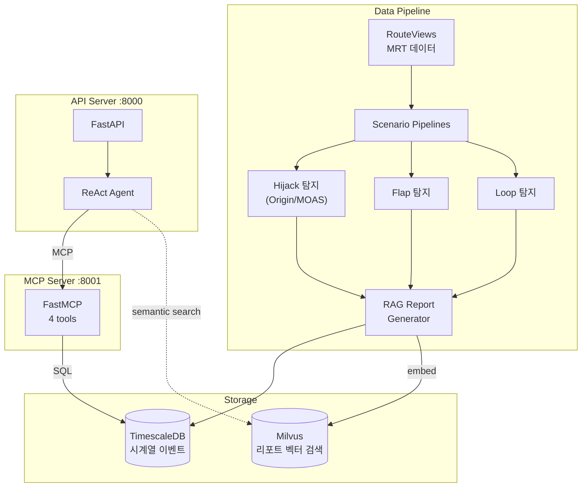

# bgp-mcp-server

BGP(Border Gateway Protocol) 이상 탐지 및 분석을 위한 MCP 기반 AI 분석 서버.

RouteViews 데이터를 시나리오별(Hijack, Flap, Loop) 파이프라인으로 가공하여 TimescaleDB에 적재하고, Milvus 벡터 검색 + MCP 도구 기반 ReAct Agent로 BGP 이상 현상을 분석합니다.

## Architecture



## Tech Stack

| Layer | Stack |
|-------|-------|
| Backend | FastAPI, uvicorn |
| Agent | LangGraph ReAct, LangChain MCP Adapters |
| MCP | FastMCP (4 tools) |
| Database | TimescaleDB (시계열), Milvus (벡터 검색) |
| ML | HuggingFace Embeddings, Sentence Transformers |
| Data | pybgpstream (RouteViews), mrtparse |
| Workflow | LangGraph StateGraph (multi-server orchestration) |

## Project Structure

```
server/
├── main.py                       # FastAPI 엔트리포인트
├── bgp_realtime_streaming.py     # pybgpstream 실시간 수집
├── retriever.py                  # Milvus RAG retriever + chain
├── config/
│   ├── database.py               # TimescaleDB 연결
│   └── logging_config.py         # 로깅 설정
├── routers/
│   ├── chat.py                   # 채팅 API (채팅방 관리)
│   └── invoke.py                 # Agent 호출 엔드포인트
├── services/
│   └── agent_service.py          # MCP ReAct agent 초기화
├── mcp/
│   ├── server.py                 # FastMCP 서버 (4 tools)
│   ├── query_execution.py        # SQL 실행 엔진
│   └── answer_generation.py      # 응답 생성
├── workflows/
│   ├── workflow.py               # LangGraph StateGraph 정의
│   └── graph_nodes.py            # 3-node 워크플로우
├── models/
│   ├── chat.py                   # 채팅 모델
│   ├── chat_room.py              # 채팅방 모델
│   └── schemas.py                # GraphState 등 스키마
├── scripts/
│   ├── scenarios/                # 시나리오별 탐지 파이프라인
│   │   ├── hijack/               # Origin Hijack, MOAS 탐지
│   │   ├── flap/                 # Route Flap 탐지
│   │   ├── loop/                 # AS-Path Loop 탐지
│   │   └── common/rag/           # RAG 리포트 생성·적재
│   ├── run_pipeline.py           # 파이프라인 실행
│   └── vector_db/                # Milvus 임베딩 적재
├── eval/                         # 시나리오별 LLM 평가
│   ├── hijack/                   # Hijack 평가 세트
│   ├── flap/                     # Flap 평가 세트
│   └── loop/                     # Loop 평가 세트
└── routeviews_data/              # RouteViews MRT 헤더 파싱

docker-compose.yml                # TimescaleDB + app
```

## MCP Tools

| Tool | Role |
|------|------|
| `get_system_instructions` | BGP 분석 전문가 시스템 지침 |
| `get_bgp_schema` | DB 테이블 스키마 정보 |
| `get_sql_examples` | Few-shot SQL 예제 |
| `execute_bgp_query` | SQL 실행 + 토큰 제한 자동 적용 |

## Key Design Decisions

### 시나리오 기반 탐지 파이프라인

BGP 이상 유형별로 독립적인 탐지 로직을 분리했습니다.

| Scenario | Detection | Description |
|----------|-----------|-------------|
| Hijack | Origin AS 변경, MOAS | 경로 탈취 탐지 |
| Flap | 경로 진동 빈도 | 불안정 경로 탐지 |
| Loop | AS-Path 순환 | 라우팅 루프 탐지 |

각 시나리오가 독립 파이프라인으로 실행되며, 공통 RAG 리포트 생성기가 결과를 Milvus에 적재합니다.

### MCP Tool Call 기반 시스템 지침 전달

시스템 프롬프트를 하드코딩하지 않고 `get_system_instructions` MCP 도구로 제공합니다. Agent가 첫 호출 시 도구를 통해 역할과 분석 프로세스를 수신하여, 도구 서버 측에서 지침을 중앙 관리할 수 있습니다.

### TimescaleDB 시계열 저장

BGP 이벤트는 시간 축 기반 분석이 핵심이므로 TimescaleDB를 선택했습니다. 시간 범위 쿼리와 집계가 빈번한 BGP 데이터 특성에 적합합니다.

## Getting Started

```bash
# 인프라 (TimescaleDB)
docker compose up -d

# 환경 변수
cp .env.example .env
# OPENAI_API_KEY, MILVUS_HOST 등 설정

# 의존성 설치
cd server && pip install -r requirements.txt

# MCP 서버 + API 서버 실행
python main.py
```

| Variable | Description |
|----------|-------------|
| `OPENAI_API_KEY` | OpenAI API key |
| `TIMESCALE_URI` | TimescaleDB connection |
| `MILVUS_HOST/PORT` | Milvus 연결 |
| `OLLAMA_HOST/PORT` | Ollama 로컬 모델 (optional) |
